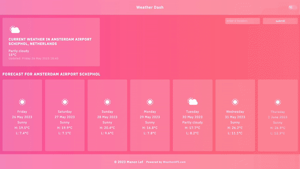

# To-Do App Procrasti-Not

## Result
[Live Version](https://manonlef.github.io/weather-app/)

## About this project
This project was mostly about working with API's and asynchronous code. 

## Objectives
- [x] display the weather using the WeatherAPI 
- [x] toggle Fahrenheit or Celsius
- [x] change the look of the page based on the data
- [x] use Promises or Async/Await in the code 
- [x] add a form that lets users input their location

## Notes and Lessons Learned
There was a lot of data to play with. Reaching the world of API's I found my creativity skyrocketed! I really had to remind myself multiple times that I had to stick to the objective for there would be more to learn after this project. I noted all my future feature ideas in [my notes](./resources-and-notes/notes) for some peace of mind and I can definitely see myself getting back to this project in the future.

- **Project Notes:** I've taken a lot of notes during this project with near-daily updates that can be found [here](./resources-and-notes/notes).
- I decided not to change the background depending on the weather. I felt like I'd learn nothing new there and would just be increasing the amount of time until project completion. I did however decide to implement the icons the API provides for the current and forecast weather conditions.
- This project was a delight to work on. Opening up the world of API's and all the data it can provide really feels like a big step was made. 

## Features or things I'd love to work on for this project in the future
- [ ] Hourly forecast for today
- [ ] My own illustrated backgrounds to change the mood depending on weather
- [ ] My own icons
- [ ] SuperMaybe: Add an Aviation Toggle to display TAFs and METARs
- [ ] More specific error handling

